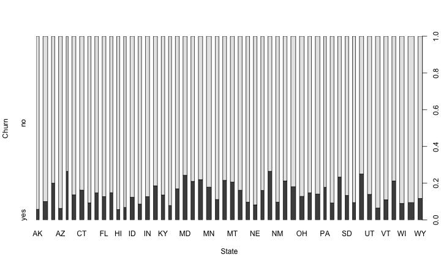
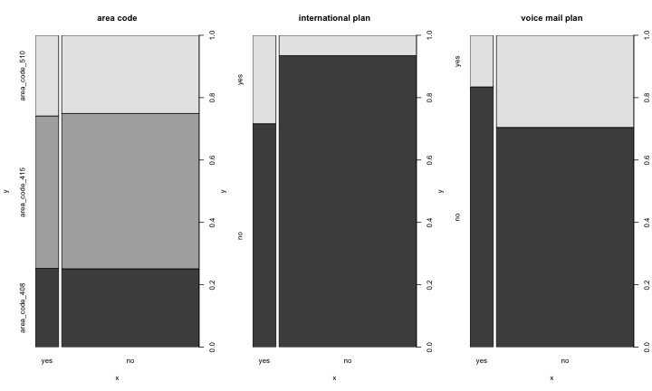

Análise de churn
========================================================

O objetivo deste trabalho é criar um modelo preditivo para identificar atuais clientes que possam deixar de ser clientes da empresa.


```r
library(C50)
data(churn)
```


Para alcançar este objetivo será necessário:

* realizar a análise descritiva dos dados, identificando anomalias, valores faltantes e outras características;
* criar um modelo preditivo usando o algoritmo J48;
* criar um modelo preditivo usando o algoritmo _random forest_;
* identificar qual é o modelo com maior acurácia, e;
* aplicá-lo no conjunto de teste.

Análise descritiva
------------------

Quais são os tipos dos atributos?


```r
sapply(churnTrain, class)
```

```
##                         state                account_length 
##                      "factor"                     "integer" 
##                     area_code            international_plan 
##                      "factor"                      "factor" 
##               voice_mail_plan         number_vmail_messages 
##                      "factor"                     "integer" 
##             total_day_minutes               total_day_calls 
##                     "numeric"                     "integer" 
##              total_day_charge             total_eve_minutes 
##                     "numeric"                     "numeric" 
##               total_eve_calls              total_eve_charge 
##                     "integer"                     "numeric" 
##           total_night_minutes             total_night_calls 
##                     "numeric"                     "integer" 
##            total_night_charge            total_intl_minutes 
##                     "numeric"                     "numeric" 
##              total_intl_calls             total_intl_charge 
##                     "integer"                     "numeric" 
## number_customer_service_calls                         churn 
##                     "integer"                      "factor"
```


Analisando o atributo _state_


```r
table(churnTrain$state)
```

```
## 
##  AK  AL  AR  AZ  CA  CO  CT  DC  DE  FL  GA  HI  IA  ID  IL  IN  KS  KY 
##  52  80  55  64  34  66  74  54  61  63  54  53  44  73  58  71  70  59 
##  LA  MA  MD  ME  MI  MN  MO  MS  MT  NC  ND  NE  NH  NJ  NM  NV  NY  OH 
##  51  65  70  62  73  84  63  65  68  68  62  61  56  68  62  66  83  78 
##  OK  OR  PA  RI  SC  SD  TN  TX  UT  VA  VT  WA  WI  WV  WY 
##  61  78  45  65  60  60  53  72  72  77  73  66  78 106  77
```

```r
length(levels(churnTrain$state))
```

```
## [1] 51
```

```r
plot(churnTrain$state, churnTrain$churn, xlab = "State", ylab = "Churn")
```

 


Analisando o restante dos atributos categóricos:


```r
par(mfrow = c(1, 3))
plot(churnTrain$churn, churnTrain$area_code, main = "area code")
plot(churnTrain$churn, churnTrain$international_plan, main = "international plan")
plot(churnTrain$churn, churnTrain$voice_mail_plan, main = "voice mail plan")
```

 


Analisando os atributos numéricos:


```r
sapply(churnTrain[, c(2, 6:19)], summary)
```

```
##         account_length number_vmail_messages total_day_minutes
## Min.                 1                   0.0                 0
## 1st Qu.             74                   0.0               144
## Median             101                   0.0               179
## Mean               101                   8.1               180
## 3rd Qu.            127                  20.0               216
## Max.               243                  51.0               351
##         total_day_calls total_day_charge total_eve_minutes total_eve_calls
## Min.                  0              0.0                 0               0
## 1st Qu.              87             24.4               167              87
## Median              101             30.5               201             100
## Mean                100             30.6               201             100
## 3rd Qu.             114             36.8               235             114
## Max.                165             59.6               364             170
##         total_eve_charge total_night_minutes total_night_calls
## Min.                 0.0                23.2                33
## 1st Qu.             14.2               167.0                87
## Median              17.1               201.0               100
## Mean                17.1               201.0               100
## 3rd Qu.             20.0               235.0               113
## Max.                30.9               395.0               175
##         total_night_charge total_intl_minutes total_intl_calls
## Min.                  1.04                0.0             0.00
## 1st Qu.               7.52                8.5             3.00
## Median                9.05               10.3             4.00
## Mean                  9.04               10.2             4.48
## 3rd Qu.              10.60               12.1             6.00
## Max.                 17.80               20.0            20.00
##         total_intl_charge number_customer_service_calls
## Min.                 0.00                          0.00
## 1st Qu.              2.30                          1.00
## Median               2.78                          1.00
## Mean                 2.76                          1.56
## 3rd Qu.              3.27                          2.00
## Max.                 5.40                          9.00
```


Modelo com o algoritmo J48
--------------------------

Fazendo __cross-validation__ com J48:


```r
library(RWeka)
library(ipred)
```

```
## Loading required package: rpart
```

```
## Loading required package: MASS
```

```
## Loading required package: survival
```

```
## Loading required package: splines
```

```
## Loading required package: nnet
```

```
## Loading required package: class
```

```
## Loading required package: prodlim
```

```
## KernSmooth 2.23 loaded Copyright M. P. Wand 1997-2009
```

```r
set.seed(1234)
error <- numeric(10)
for (i in 1:10) error[i] <- errorest(churn ~ ., data = churnTrain, model = J48)$error
error
```

```
##  [1] 0.05971 0.06091 0.06331 0.05671 0.06211 0.06211 0.05761 0.06241
##  [9] 0.06211 0.06481
```

```r
summary(error)
```

```
##    Min. 1st Qu.  Median    Mean 3rd Qu.    Max. 
##  0.0567  0.0600  0.0621  0.0612  0.0623  0.0648
```


```r
print(model)
```

```
## Error: objeto 'model' não encontrado
```


Gerando o modelo com o todo o conjunto de treinamento:


```r
model <- J48(churn ~ ., data = churnTrain)
plot(model)
```

```
## Loading required package: party
```

```
## Loading required package: grid
```

```
## Loading required package: modeltools
```

```
## Loading required package: stats4
```

```
## Loading required package: coin
```

```
## Loading required package: mvtnorm
```

```
## Loading required package: zoo
```

```
## Attaching package: 'zoo'
```

```
## The following object(s) are masked from 'package:base':
## 
## as.Date, as.Date.numeric
```

```
## Loading required package: sandwich
```

```
## Loading required package: strucchange
```

```
## Loading required package: vcd
```

```
## Loading required package: colorspace
```

```
## Error: Plotting of trees with multi-way splits is currently not
## implemented.
```


Modelo com o algoritmo _random forest_
--------------------------------------


Comparação dos modelos
----------------------


Validação do modelo com o conjunto de testes
--------------------------------------------


