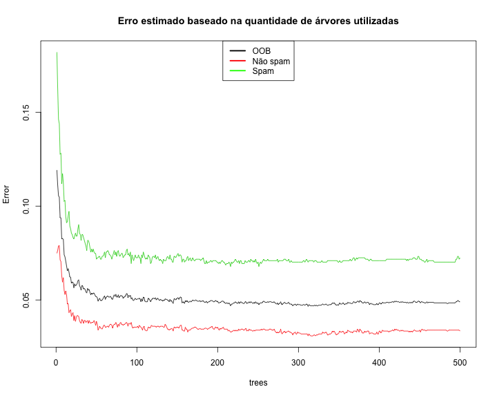
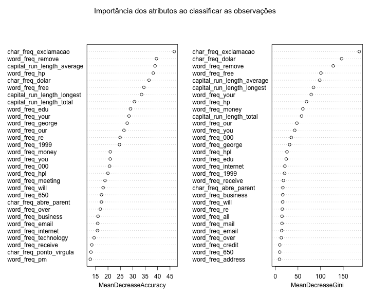

Classificação de Spam usando o algoritmo Random Forest
========================================================

O objetivo deste script é demonstrar a criação de um modelo preditivo no formato de uma floresta de árvores de decisão para identificar spam. Para tanto, será utilizado o dataset disponibilizado em __http://archive.ics.uci.edu/ml/datasets/Spambase__

Carga dos dados:


```r
spambase <- read.csv("../data/spambase.data", header = F)

names(spambase) <- c("word_freq_make", "word_freq_address", "word_freq_all", 
    "word_freq_3d", "word_freq_our", "word_freq_over", "word_freq_remove", "word_freq_internet", 
    "word_freq_order", "word_freq_mail", "word_freq_receive", "word_freq_will", 
    "word_freq_people", "word_freq_report", "word_freq_addresses", "word_freq_free", 
    "word_freq_business", "word_freq_email", "word_freq_you", "word_freq_credit", 
    "word_freq_your", "word_freq_font", "word_freq_000", "word_freq_money", 
    "word_freq_hp", "word_freq_hpl", "word_freq_george", "word_freq_650", "word_freq_lab", 
    "word_freq_labs", "word_freq_telnet", "word_freq_857", "word_freq_data", 
    "word_freq_415", "word_freq_85", "word_freq_technology", "word_freq_1999", 
    "word_freq_parts", "word_freq_pm", "word_freq_direct", "word_freq_cs", "word_freq_meeting", 
    "word_freq_original", "word_freq_project", "word_freq_re", "word_freq_edu", 
    "word_freq_table", "word_freq_conference", "char_freq_ponto_virgula", "char_freq_abre_parent", 
    "char_freq_abre_conche", "char_freq_exclamacao", "char_freq_dolar", "char_freq_cerca", 
    "capital_run_length_average", "capital_run_length_longest", "capital_run_length_total", 
    "spam")

sapply(spambase, class)
```

```
##             word_freq_make          word_freq_address 
##                  "numeric"                  "numeric" 
##              word_freq_all               word_freq_3d 
##                  "numeric"                  "numeric" 
##              word_freq_our             word_freq_over 
##                  "numeric"                  "numeric" 
##           word_freq_remove         word_freq_internet 
##                  "numeric"                  "numeric" 
##            word_freq_order             word_freq_mail 
##                  "numeric"                  "numeric" 
##          word_freq_receive             word_freq_will 
##                  "numeric"                  "numeric" 
##           word_freq_people           word_freq_report 
##                  "numeric"                  "numeric" 
##        word_freq_addresses             word_freq_free 
##                  "numeric"                  "numeric" 
##         word_freq_business            word_freq_email 
##                  "numeric"                  "numeric" 
##              word_freq_you           word_freq_credit 
##                  "numeric"                  "numeric" 
##             word_freq_your             word_freq_font 
##                  "numeric"                  "numeric" 
##              word_freq_000            word_freq_money 
##                  "numeric"                  "numeric" 
##               word_freq_hp              word_freq_hpl 
##                  "numeric"                  "numeric" 
##           word_freq_george              word_freq_650 
##                  "numeric"                  "numeric" 
##              word_freq_lab             word_freq_labs 
##                  "numeric"                  "numeric" 
##           word_freq_telnet              word_freq_857 
##                  "numeric"                  "numeric" 
##             word_freq_data              word_freq_415 
##                  "numeric"                  "numeric" 
##               word_freq_85       word_freq_technology 
##                  "numeric"                  "numeric" 
##             word_freq_1999            word_freq_parts 
##                  "numeric"                  "numeric" 
##               word_freq_pm           word_freq_direct 
##                  "numeric"                  "numeric" 
##               word_freq_cs          word_freq_meeting 
##                  "numeric"                  "numeric" 
##         word_freq_original          word_freq_project 
##                  "numeric"                  "numeric" 
##               word_freq_re              word_freq_edu 
##                  "numeric"                  "numeric" 
##            word_freq_table       word_freq_conference 
##                  "numeric"                  "numeric" 
##    char_freq_ponto_virgula      char_freq_abre_parent 
##                  "numeric"                  "numeric" 
##      char_freq_abre_conche       char_freq_exclamacao 
##                  "numeric"                  "numeric" 
##            char_freq_dolar            char_freq_cerca 
##                  "numeric"                  "numeric" 
## capital_run_length_average capital_run_length_longest 
##                  "numeric"                  "integer" 
##   capital_run_length_total                       spam 
##                  "integer"                  "integer"
```

```r
spambase$spam <- as.factor(paste(spambase$spam))
```


Divisão entre conjunto de treinamento e conjunto de teste.


```r
set.seed(1234)
ind <- sample(2, nrow(spambase), replace = TRUE, prob = c(0.7, 0.3))
trainData <- spambase[ind == 1, ]
testData <- spambase[ind == 2, ]

table(trainData$spam)
```

```
## 
##    0    1 
## 1944 1297
```


Criação do modelo:


```r
library(randomForest)
spam_model_rf <- randomForest(spam ~ ., data = trainData, importance = TRUE, 
    do.trace = 100)
```

```
## ntree      OOB      1      2
##   100:   5.03%  3.55%  7.25%
##   200:   4.94%  3.55%  7.02%
##   300:   4.75%  3.24%  7.02%
##   400:   4.84%  3.34%  7.09%
##   500:   4.91%  3.34%  7.25%
```

```r
spam_model_rf
```

```
## 
## Call:
##  randomForest(formula = spam ~ ., data = trainData, importance = TRUE,      do.trace = 100) 
##                Type of random forest: classification
##                      Number of trees: 500
## No. of variables tried at each split: 7
## 
##         OOB estimate of  error rate: 4.91%
## Confusion matrix:
##      0    1 class.error
## 0 1879   65     0.03344
## 1   94 1203     0.07247
```


Validação do modelo usando o próprio conjunto de treinamento:


```r
t <- table(predict(spam_model_rf), trainData$spam)
acuracia_treinamento <- (t[1, 1] + t[2, 2])/sum(t)
t
```

```
##    
##        0    1
##   0 1879   94
##   1   65 1203
```

```r
acuracia_treinamento
```

```
## [1] 0.9509
```


```r
plot(spam_model_rf, lty = c(1, 1, 1), main = "Erro estimado baseado na quantidade de árvores utilizadas")
legend("top", c("OOB", "Não spam", "Spam"), lty = c(1, 1, 1), lwd = c(2.5, 
    2.5, 2.5), col = c("black", "red", "green"))
```

 


```r
varImpPlot(spam_model_rf, main = "Importância dos atributos ao classificar as observações")
```

 


Validação do modelo usando o conjunto de testes:


```r
testPred <- predict(spam_model_rf, newdata = testData)
t <- table(testPred, testData$spam)
acuracia_teste <- (t[1, 1] + t[2, 2])/sum(t)
t
```

```
##         
## testPred   0   1
##        0 821  46
##        1  23 470
```

```r
acuracia_teste
```

```
## [1] 0.9493
```


Este material faz parte do curso sobre [Web Data Mining com R](http://fbarth.net.br/materiais/webMiningR.html)
