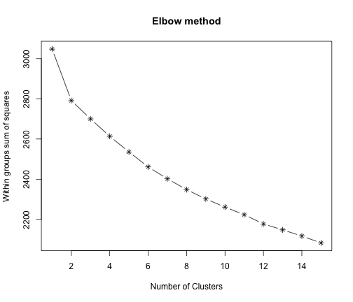

Identificação de agrupamentos em mensagens do Twitter
========================================================


```r
Sys.setenv(NOAWT = TRUE)
library(tm)
library(Snowball)
```


Carga do corpus:


```r
load("../data/protesto.rda")
myCorpus <- Corpus(VectorSource(df$text))
inspect(myCorpus[1:3])
```

```
## A corpus with 3 text documents
## 
## The metadata consists of 2 tag-value pairs and a data frame
## Available tags are:
##   create_date creator 
## Available variables in the data frame are:
##   MetaID 
## 
## [[1]]
## RT @marcogomes: http://t.co/hzLMV2DRxT Relato de uma senhora de classe média sobre a exemplar atuação da @pmesp em um hospital. #protestosp
## 
## [[2]]
## Acompanhei ontem o protesto pela internet, vejo na Globo hoje vejo a mídia mostrando algo completamente diferente do que era #protestoSP
## 
## [[3]]
## Verás que um filho teu não foge à luta!!! http://t.co/QmSILTwaZ4 -- #protestosp
```


Aplicando transformações no corpus, removendo acentos e convertendo para caixa baixa:


```r
myCorpus <- tm_map(myCorpus, function(x) iconv(x, to = "ASCII//TRANSLIT"))
myCorpus <- tm_map(myCorpus, tolower)
```


Removendo pontuação, números e stop-words: 


```r
myCorpus <- tm_map(myCorpus, removePunctuation)
myCorpus <- tm_map(myCorpus, removeNumbers)
myCorpus <- tm_map(myCorpus, removeWords, stopwords("portuguese"))
myCorpus <- tm_map(myCorpus, removeWords, c("mim", "alguem", "nao", "pra"))
inspect(myCorpus[1:3])
```

```
## A corpus with 3 text documents
## 
## The metadata consists of 2 tag-value pairs and a data frame
## Available tags are:
##   create_date creator 
## Available variables in the data frame are:
##   MetaID 
## 
## [[1]]
## rt marcogomes httptcohzlmvdrxt relato   senhora  classe media sobre  exemplar atuacao  pmesp   hospital protestosp
## 
## [[2]]
## acompanhei ontem  protesto  internet vejo  globo hoje vejo  midia mostrando algo completamente diferente    protestosp
## 
## [[3]]
## veras   filho   foge  luta httptcoqmsiltwaz  protestosp
```


Construindo uma matriz de documentos versus termos:


```r
myTable <- TermDocumentMatrix(myCorpus)
myTable
```

```
## A term-document matrix (1410 terms, 350 documents)
## 
## Non-/sparse entries: 3115/490385
## Sparsity           : 99%
## Maximal term length: 25 
## Weighting          : term frequency (tf)
```

```r
inspect(myTable[1:10, 1:10])
```

```
## A term-document matrix (10 terms, 10 documents)
## 
## Non-/sparse entries: 1/99
## Sparsity           : 99%
## Maximal term length: 9 
## Weighting          : term frequency (tf)
## 
##            Docs
## Terms       1 2 3 4 5 6 7 8 9 10
##   abaixar   0 0 0 0 0 0 0 0 0  0
##   abaixo    0 0 0 0 0 0 0 0 0  0
##   abordagem 0 0 0 0 0 0 0 0 0  0
##   abro      0 0 0 0 0 0 0 0 0  0
##   absurdo   0 0 0 0 0 0 0 0 0  0
##   abuso     0 0 0 0 0 0 0 0 0  0
##   abusos    0 0 0 0 0 0 0 0 0  0
##   acao      0 0 0 0 0 0 0 0 0  0
##   acha      0 0 0 0 0 0 0 1 0  0
##   acho      0 0 0 0 0 0 0 0 0  0
```


Identificando os termos mais frequentes:


```r
findFreqTerms(myTable, lowfreq = 20)
```

```
##  [1] "democratica"       "enfim"             "gizmodobr"        
##  [4] "httptcokrerspgnbg" "marcogomes"        "passelivre"       
##  [7] "paulo"             "protesto"          "protestosp"       
## [10] "redes"             "revolucionaria"    "sao"              
## [13] "sobre"             "sociais"           "usamos"           
## [16] "veia"              "vinagre"
```


Identificando as palavras que estão associadas com a palavra "protestosp" (da hash tag #protestosp):


```r
findAssocs(myTable, "protestosp", 0.1)
```

```
##       democratica             enfim         gizmodobr    revolucionaria 
##              0.20              0.20              0.20              0.20 
##            usamos              veia httptcokrerspgnbg        marcogomes 
##              0.20              0.20              0.19              0.18 
##             redes           sociais        passelivre        protestorj 
##              0.17              0.17              0.16              0.15 
##     brasilacordou             sobre               spj            brazil 
##              0.13              0.12              0.12              0.11 
##          vandalos           vinagre              hoje               its 
##              0.11              0.11              0.10              0.10
```


Identificando os agrupamentos
-----------------------------

Construindo uma matriz termos versus documentos para iniciar o processo de clustering:


```r
# aplicando algoritmo de stemming para reduzir a dimensao da matriz
myCorpus <- tm_map(myCorpus, stemDocument, language = "portuguese")
inspect(myCorpus[1:3])
```

```
## A corpus with 3 text documents
## 
## The metadata consists of 2 tag-value pairs and a data frame
## Available tags are:
##   create_date creator 
## Available variables in the data frame are:
##   MetaID 
## 
## [[1]]
## rt marcogom httptcohzlmvdrxt relat   senhor  class med sobr  exempl atuaca  pmesp   hospital protestosp
## 
## [[2]]
## acompanh ontem  protest  internet vej  glob hoj vej  mid mostr algo complet diferent    protestosp
## 
## [[3]]
## ver   filh   fog  lut httptcoqmsiltwaz  protestosp
```

```r
docs_term <- DocumentTermMatrix(myCorpus)
```


Implementação da função _elbow_ utilizada na identificação do melhor número de agrupamentos.


```r
set.seed(1234)
elbow <- function(dataset) {
    wss <- numeric(15)
    for (i in 1:15) wss[i] <- sum(kmeans(dataset, centers = i, nstart = 100)$withinss)
    plot(1:15, wss, type = "b", main = "Elbow method", xlab = "Number of Clusters", 
        ylab = "Within groups sum of squares", pch = 8)
}
```


Resultado da função _elbow_ e o tempo de processamento:


```r
system.time(elbow(docs_term))
```

 

```
##    user  system elapsed 
## 162.288   1.606 165.399
```


Execução do _k-means_ com 12 agrupamentos:


```r
cluster_model <- kmeans(docs_term, centers = 12, nstart = 100)
table(cluster_model$cluster)
```

```
## 
##   1   2   3   4   5   6   7   8   9  10  11  12 
##   3   7   8  32  92   5   5   7   3   7 166  15
```

```r
cluster_model$withinss
```

```
##  [1]    0.000    2.571    0.000   17.781  775.446   70.000    2.400
##  [8]    4.286    0.000    2.571 1213.114   86.800
```


Visualização dos agrupamentos:


```r
df[cluster_model$cluster == 3, c(1, 10)]
```

```
##                                                                                                                                             text
## 91  RT @shaunwhitcher: Looks like Turkey, but it's actually São Paulo, Brazil. http://t.co/xoL8HR0M1g #sp13j #passelivre #protestosp” #occupyge…
## 99  RT @shaunwhitcher: Looks like Turkey, but it's actually São Paulo, Brazil. http://t.co/xoL8HR0M1g #sp13j #passelivre #protestosp” #occupyge…
## 116 RT @shaunwhitcher: Looks like Turkey, but it's actually São Paulo, Brazil. http://t.co/xoL8HR0M1g #sp13j #passelivre #protestosp” #occupyge…
## 134 RT @shaunwhitcher: Looks like Turkey, but it's actually São Paulo, Brazil. http://t.co/xoL8HR0M1g #sp13j #passelivre #protestosp” #occupyge…
## 156 RT @shaunwhitcher: Looks like Turkey, but it's actually São Paulo, Brazil. http://t.co/xoL8HR0M1g #sp13j #passelivre #protestosp” #occupyge…
## 190 RT @shaunwhitcher: Looks like Turkey, but it's actually São Paulo, Brazil. http://t.co/xoL8HR0M1g #sp13j #passelivre #protestosp” #occupyge…
## 194 RT @shaunwhitcher: Looks like Turkey, but it's actually São Paulo, Brazil. http://t.co/xoL8HR0M1g #sp13j #passelivre #protestosp” #occupyge…
## 221 RT @shaunwhitcher: Looks like Turkey, but it's actually São Paulo, Brazil. http://t.co/xoL8HR0M1g #sp13j #passelivre #protestosp” #occupyge…
##         screenName
## 91      maspoxasan
## 99  fuckyeahmoreno
## 116      Leopastor
## 134    JonasVyktor
## 156  occupyormedia
## 190   RafaelVerger
## 194   Kress_Lovers
## 221      tiago_jsp
```

```r
df[cluster_model$cluster == 4, c(1, 10)]
```

```
##                                                                                                                                             text
## 11                         RT @GizmodoBR: #ProtestoSP Enfim usamos a veia democrática e revolucionária das redes sociais: http://t.co/KReRSpgnBg
## 13                         RT @gizmodobr: #ProtestoSP Enfim usamos a veia democrática e revolucionária das redes sociais: http://t.co/beIKLu0bwG
## 22                                         #ProtestoSP Enfim usamos a veia democrática e revolucionária das redes sociais http://t.co/62Z0QnLUhL
## 79                         RT @GizmodoBR: #ProtestoSP Enfim usamos a veia democrática e revolucionária das redes sociais: http://t.co/KReRSpgnBg
## 106                        RT @GizmodoBR: #ProtestoSP Enfim usamos a veia democrática e revolucionária das redes sociais: http://t.co/KReRSpgnBg
## 112                        RT @GizmodoBR: #ProtestoSP Enfim usamos a veia democrática e revolucionária das redes sociais: http://t.co/KReRSpgnBg
## 122                        RT @GizmodoBR: #ProtestoSP Enfim usamos a veia democrática e revolucionária das redes sociais: http://t.co/KReRSpgnBg
## 137                        RT @GizmodoBR: #ProtestoSP Enfim usamos a veia democrática e revolucionária das redes sociais: http://t.co/KReRSpgnBg
## 143                        RT @GizmodoBR: #ProtestoSP Enfim usamos a veia democrática e revolucionária das redes sociais: http://t.co/KReRSpgnBg
## 154     Resumões linkados. RT @GizmodoBR: #ProtestoSP Enfim usamos a veia democrática e revolucionária das redes sociais: http://t.co/KUn7Elqb8m
## 155                        RT @GizmodoBR: #ProtestoSP Enfim usamos a veia democrática e revolucionária das redes sociais: http://t.co/KReRSpgnBg
## 158                        RT @GizmodoBR: #ProtestoSP Enfim usamos a veia democrática e revolucionária das redes sociais: http://t.co/KReRSpgnBg
## 161                        RT @GizmodoBR: #ProtestoSP Enfim usamos a veia democrática e revolucionária das redes sociais: http://t.co/KReRSpgnBg
## 164                        RT @GizmodoBR: #ProtestoSP Enfim usamos a veia democrática e revolucionária das redes sociais: http://t.co/KReRSpgnBg
## 171 Espero q seja só o começo RT @GizmodoBR: #ProtestoSP Enfim usamos a veia democrática e revolucionária das r.sociais: http://t.co/jWFaSfy3n0”
## 180                        RT @GizmodoBR: #ProtestoSP Enfim usamos a veia democrática e revolucionária das redes sociais: http://t.co/KReRSpgnBg
## 182                        RT @GizmodoBR: #ProtestoSP Enfim usamos a veia democrática e revolucionária das redes sociais: http://t.co/KReRSpgnBg
## 183                        RT @GizmodoBR: #ProtestoSP Enfim usamos a veia democrática e revolucionária das redes sociais: http://t.co/KReRSpgnBg
## 191                Terrorismo é democrático agora... "@GizmodoBR: #ProtestoSP Enfim usamos a veia democrática e revolucionária das redes sociais
## 200                        RT @GizmodoBR: #ProtestoSP Enfim usamos a veia democrática e revolucionária das redes sociais: http://t.co/KReRSpgnBg
## 203                        RT @GizmodoBR: #ProtestoSP Enfim usamos a veia democrática e revolucionária das redes sociais: http://t.co/KReRSpgnBg
## 218                        RT @GizmodoBR: #ProtestoSP Enfim usamos a veia democrática e revolucionária das redes sociais: http://t.co/KReRSpgnBg
## 219                        RT @GizmodoBR: #ProtestoSP Enfim usamos a veia democrática e revolucionária das redes sociais: http://t.co/KReRSpgnBg
## 226                        RT @GizmodoBR: #ProtestoSP Enfim usamos a veia democrática e revolucionária das redes sociais: http://t.co/KReRSpgnBg
## 229                        RT @GizmodoBR: #ProtestoSP Enfim usamos a veia democrática e revolucionária das redes sociais: http://t.co/KReRSpgnBg
## 231                        RT @GizmodoBR: #ProtestoSP Enfim usamos a veia democrática e revolucionária das redes sociais: http://t.co/KReRSpgnBg
## 235                        RT @GizmodoBR: #ProtestoSP Enfim usamos a veia democrática e revolucionária das redes sociais: http://t.co/KReRSpgnBg
## 239                        RT @GizmodoBR: #ProtestoSP Enfim usamos a veia democrática e revolucionária das redes sociais: http://t.co/KReRSpgnBg
## 240                        RT @GizmodoBR: #ProtestoSP Enfim usamos a veia democrática e revolucionária das redes sociais: http://t.co/KReRSpgnBg
## 245                        RT @GizmodoBR: #ProtestoSP Enfim usamos a veia democrática e revolucionária das redes sociais: http://t.co/KReRSpgnBg
## 247                        RT @GizmodoBR: #ProtestoSP Enfim usamos a veia democrática e revolucionária das redes sociais: http://t.co/KReRSpgnBg
## 250                        RT @GizmodoBR: #ProtestoSP Enfim usamos a veia democrática e revolucionária das redes sociais: http://t.co/KReRSpgnBg
##          screenName
## 11        andreizze
## 13      alisson_adm
## 22        magnosama
## 79    viniciuscolli
## 106      thomstrack
## 112       Robsontra
## 122   AndreFerrazBR
## 137 gabrielnicesio_
## 143 Sra__EvilasioSP
## 154     SharpRandom
## 155      andyuehara
## 158    GabrielMazzi
## 161         elsonjr
## 164   giggsameijide
## 171  rafaelerichsen
## 180 alexandemorgado
## 182         mmurilo
## 183    espinafrando
## 191         LLean73
## 200      lucasgatto
## 203        rodrigoy
## 218  reneferracioli
## 219        samuka79
## 226        MiST3R_M
## 229          rafamd
## 231  avelinoeduardo
## 235        cvsb8675
## 239      Fujimori_9
## 240       rfltinoco
## 245         fsfonte
## 247    RomildoMarqs
## 250      Robersonfr
```

```r
df[cluster_model$cluster == 12, c(1, 10)]
```

```
##                                                                                                                                              text
## 34                             24 Momentos dos protestos em São Paulo que você não verá na TV http://t.co/bYEPnDkDfJ via @socializeWP #protestoSP
## 38                                                                         Amigos tomem cuidado que o porte de vinagre te leva preso. #protestosp
## 66                                                     RT @marcogomes: 2013, São Paulo, cuidado que o porte de vinagre te leva preso. #protestosp
## 84         Denúncia: Polícia de São Paulo #PMESP, o Pão de Açúcar do lado aqui de casa está com um estoque gigantesco de #VINAGRE!!!! #protestosp
## 103                                                    RT @marcogomes: 2013, São Paulo, cuidado que o porte de vinagre te leva preso. #protestosp
## 132                                               RT @rbertoli: To comendo feijoada com salada temperada com vinagre. Fuck da police! #protestosp
## 135 RT @jornalodia: Protesto em São Paulo: jornalista é preso por carregar vinagre na mochila http://t.co/UHfDBXp7ZB\n#passelivre #protestosp #o…
## 141                                                    RT @marcogomes: 2013, São Paulo, cuidado que o porte de vinagre te leva preso. #protestosp
## 145                                               RT @rbertoli: To comendo feijoada com salada temperada com vinagre. Fuck da police! #protestosp
## 152                                                             To comendo feijoada com salada temperada com vinagre. Fuck da police! #protestosp
## 177                               Policial Quebra Vidro da Própria Viatura - São Paulo 13/6/2013: http://t.co/GvsPioHMAp via @youtube #protestosp
## 213                                                    RT @marcogomes: 2013, São Paulo, cuidado que o porte de vinagre te leva preso. #protestosp
## 220                                                              #ProtestoSP This is not a war zone ... this is são Paulo https://t.co/dwGolMIJCp
## 243                                                    RT @marcogomes: 2013, São Paulo, cuidado que o porte de vinagre te leva preso. #protestosp
## 270                                 RT @portalR7: V de Vinagre: redes sociais reagem com ironia à polícia de São Paulo http://t.co/bORmMVkKy2 #R7
##          screenName
## 34      Lu_Antunes_
## 38        diego_job
## 66  leandrocorrea84
## 84       ramiromelo
## 103   aroldoarantes
## 132       rfltinoco
## 135    lindaflorees
## 141   nasombradoego
## 145    reuelalmeida
## 152        rbertoli
## 177        fansilva
## 213     aabandonada
## 220        boina_on
## 243        boina_on
## 270  LePrassaMarcos
```


Este material faz parte do curso sobre [Web Data Mining com R](http://fbarth.net.br/materiais/webMiningR.html)
