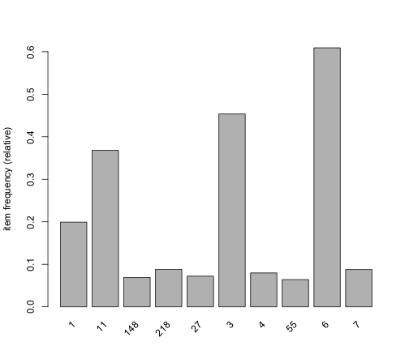
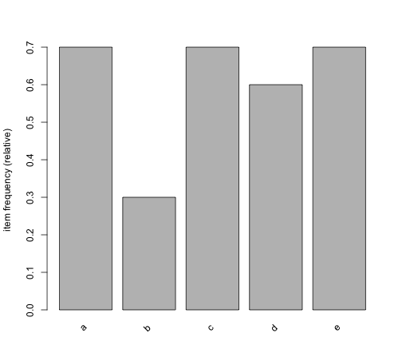
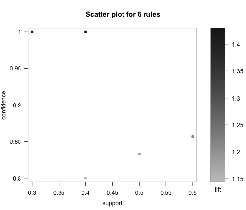
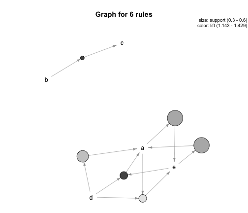

Exemplo de regras de associação em uma base de transações
==========================================================

Pacotes necessários para construir regras de associação:


```r
library(arules)
library(arulesViz)
```


Leitura do dataset de exemplo:


```r
tr <- read.transactions("../data/visitacao.txt", format = "basket", sep = ",")
tr
```

```
## transactions in sparse format with
##  10 transactions (rows) and
##  5 items (columns)
```

```r
inspect(tr)
```

```
##    items
## 1  {a,  
##     d,  
##     e}  
## 2  {b,  
##     c,  
##     d}  
## 3  {a,  
##     c,  
##     e}  
## 4  {a,  
##     c,  
##     d,  
##     e}  
## 5  {a,  
##     e}  
## 6  {a,  
##     c,  
##     d}  
## 7  {b,  
##     c}  
## 8  {a,  
##     c,  
##     d,  
##     e}  
## 9  {b,  
##     c,  
##     e}  
## 10 {a,  
##     d,  
##     e}
```


Análise de itens mais frequentes:


```r
image(tr)
```

 


```r
itemFrequencyPlot(tr, support = 0.3)
```

 


Descoberta das regras:


```r
rules <- apriori(tr, parameter = list(supp = 0.3, conf = 0.8))
```

```
## 
## parameter specification:
##  confidence minval smax arem  aval originalSupport support minlen maxlen
##         0.8    0.1    1 none FALSE            TRUE     0.3      1     10
##  target   ext
##   rules FALSE
## 
## algorithmic control:
##  filter tree heap memopt load sort verbose
##     0.1 TRUE TRUE  FALSE TRUE    2    TRUE
## 
## apriori - find association rules with the apriori algorithm
## version 4.21 (2004.05.09)        (c) 1996-2004   Christian Borgelt
## set item appearances ...[0 item(s)] done [0.00s].
## set transactions ...[5 item(s), 10 transaction(s)] done [0.00s].
## sorting and recoding items ... [5 item(s)] done [0.00s].
## creating transaction tree ... done [0.00s].
## checking subsets of size 1 2 3 done [0.00s].
## writing ... [6 rule(s)] done [0.00s].
## creating S4 object  ... done [0.00s].
```

```r
inspect(rules)
```

```
##   lhs    rhs support confidence  lift
## 1 {b} => {c}     0.3     1.0000 1.429
## 2 {d} => {a}     0.5     0.8333 1.190
## 3 {e} => {a}     0.6     0.8571 1.224
## 4 {a} => {e}     0.6     0.8571 1.224
## 5 {d,                                
##    e} => {a}     0.4     1.0000 1.429
## 6 {a,                                
##    d} => {e}     0.4     0.8000 1.143
```


Visualização das regras:


```r
plot(rules)
```

 

```r
plot(rules, method = "graph", control = list(type = "items"))
```

 


Este material faz parte do curso sobre [Web Data Mining com R](http://fbarth.net.br/materiais/webMiningR.html)
