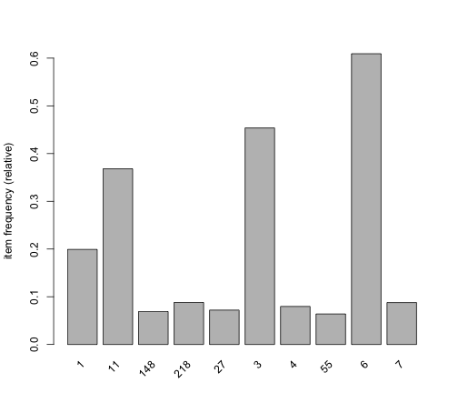

Exemplo de regras de associação em uma base de click-stream
===========================================================

Pacotes necessários para construir regras de associação:


```r
library(arules)
library(arulesViz)
```


Leitura do dataset disponibilizado em **http://fimi.ua.ac.be/data/kosarak.dat** por Ferenc Bodon.


```r
tr <- read.transactions("../data/kosarak_mix.dat", format = "basket", sep = " ")
tr
```

```
## transactions in sparse format with
##  20000 transactions (rows) and
##  13342 items (columns)
```


Análise de itens mais frequentes:


```r
itemFrequencyPlot(tr, support = 0.05)
```

 


Descoberta das regras:


```r
rules <- apriori(tr, parameter = list(supp = 0.05, conf = 0.8))
```

```
## 
## parameter specification:
##  confidence minval smax arem  aval originalSupport support minlen maxlen
##         0.8    0.1    1 none FALSE            TRUE    0.05      1     10
##  target   ext
##   rules FALSE
## 
## algorithmic control:
##  filter tree heap memopt load sort verbose
##     0.1 TRUE TRUE  FALSE TRUE    2    TRUE
## 
## apriori - find association rules with the apriori algorithm
## version 4.21 (2004.05.09)        (c) 1996-2004   Christian Borgelt
## set item appearances ...[0 item(s)] done [0.00s].
## set transactions ...[13342 item(s), 20000 transaction(s)] done [0.03s].
## sorting and recoding items ... [10 item(s)] done [0.00s].
## creating transaction tree ... done [0.01s].
## checking subsets of size 1 2 3 4 done [0.00s].
## writing ... [21 rule(s)] done [0.00s].
## creating S4 object  ... done [0.01s].
```

```r
inspect(rules)
```

```
##    lhs      rhs   support confidence   lift
## 1  {27}  => {6}   0.06070     0.8425  1.383
## 2  {7}   => {6}   0.07555     0.8605  1.412
## 3  {148} => {218} 0.05810     0.8414  9.556
## 4  {148} => {11}  0.05585     0.8088  2.197
## 5  {148} => {6}   0.06425     0.9305  1.527
## 6  {218} => {6}   0.07790     0.8847  1.452
## 7  {11}  => {6}   0.33010     0.8968  1.472
## 8  {11,                                    
##     7}   => {6}   0.05700     0.9853  1.617
## 9  {148,                                   
##     218} => {11}  0.05020     0.8640  2.347
## 10 {11,                                    
##     148} => {218} 0.05020     0.8988 10.208
## 11 {148,                                   
##     218} => {6}   0.05630     0.9690  1.591
## 12 {148,                                   
##     6}   => {218} 0.05630     0.8763  9.952
## 13 {11,                                    
##     148} => {6}   0.05555     0.9946  1.633
## 14 {148,                                   
##     6}   => {11}  0.05555     0.8646  2.349
## 15 {11,                                    
##     218} => {6}   0.06175     0.9833  1.614
## 16 {1,                                     
##     11}  => {6}   0.08405     0.9423  1.547
## 17 {11,                                    
##     3}   => {6}   0.14340     0.8844  1.452
## 18 {11,                                    
##     148,                                   
##     218} => {6}   0.05010     0.9980  1.638
## 19 {148,                                   
##     218,                                   
##     6}   => {11}  0.05010     0.8899  2.417
## 20 {11,                                    
##     148,                                   
##     6}   => {218} 0.05010     0.9019 10.243
## 21 {11,                                    
##     218,                                   
##     6}   => {148} 0.05010     0.8113 11.750
```


Visualização das regras:


```r
plot(rules)
```

 

```r
plot(rules, method = "graph", control = list(type = "items"))
```

 


Este material faz parte do curso sobre [Web Data Mining com R](http://fbarth.net.br/materiais/webMiningR.html)
